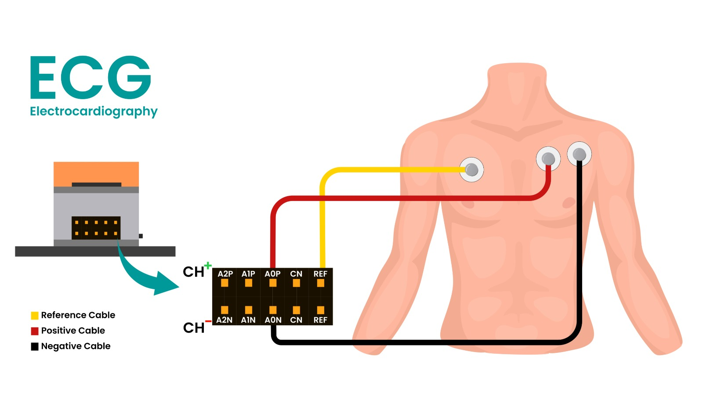

# Rpeak - Real-Time Heart Monitoring Application

A comprehensive web application for real-time ECG monitoring, heart rate variability analysis, and AI-powered heartbeat classification. Built with Next.js, TensorFlow.js, and modern web technologies for in-browser ECG signal processing.

---

> **Note:**  
> This application is currently in the **development and testing phase**. Features, performance, and results may change as improvements are made. Please use for research, learning, and prototyping only not for clinical or diagnostic purposes.

---

## ✨ Key Features

- Real-time ECG monitoring with live waveform at 360Hz sampling rate.  
- Advanced heart rate analysis using multiple peak detection algorithms and physiological validation.  
- Detection of PQRST wave components.   
- AI-powered heartbeat classification based on the AAMI EC57 standard.  
- Session recording for long-term monitoring and detailed analysis reports.  

---

## 🚀 Quick Start

### Prerequisites
- Modern web browser with Bluetooth support (Chrome, Edge)
- Compatible Npg Lite device with Bluetooth connectivity
- Node.js 18+ (for development)

### Installation

1. **Clone and setup:**
   ```bash
   git clone https://github.com/yourusername/Rpeak.git
   cd your_foldername
   npm install
   ```

2. **Start development server:**
   ```bash
   npm run dev
   ```
   Open [http://localhost:3000](http://localhost:3000)


---

## 🔧 How to Use

### 1. Connect Your Npg Lite device
- Click the **🔵 Connect** button in the sidebar
- Select your Npg Lite device from the browser's device list
- Wait for "Connected" status
- ECG waveform will automatically start displaying

### 2. Monitor Your Heart
- Real-time waveform display of your ECG signal
- Automatic heart rate calculation from detected beats

### 3. Enable Analysis Features
Click sidebar buttons to activate different analysis tools:

| Button | Feature | Description |
|--------|---------|-------------|
| 🫀 **PQRST** | Wave Analysis | Identifies P, Q, R, S, T wave components |
| ⏱️ **Intervals** | Clinical Measurements | PR, QRS, QT intervals with normal ranges |
| 💓 **HRV** | Heart Rate Variability | RMSSD, SDNN, stress level analysis |
| 🤖 **AI Analysis** | Beat Classification | Neural network heartbeat classification |
| 📊 **Session** | Recording & Reports | Long-term monitoring with detailed analysis |

### 4. Record Sessions (Optional)
- Click **📊 Session** to start recording
- Monitor for desired duration (5-10 minutes recommended)
- Stop recording to generate comprehensive analysis report

---

## 📈 Understanding Your Results

### Heart Rate
- **Normal:** 60-100 BPM (resting)
- **Bradycardia:** < 60 BPM (may be normal for athletes)
- **Tachycardia:** > 100 BPM (exercise, stress, or medical condition)

### HRV Metrics
- **RMSSD:** Higher values (>30ms) indicate better cardiovascular fitness
- **Stress Level:** Derived from multiple HRV parameters
- **LF/HF Ratio:** Balance between sympathetic/parasympathetic nervous systems

### ECG Intervals
- **PR Interval:** 120-200ms (normal conduction)
- **QRS Duration:** 80-120ms (ventricular conduction)
- **QT Interval:** Rate-corrected using Bazett's formula

### AI Classification (if enabled)
- **Normal (N):** Healthy heartbeats
- **Supraventricular (S):** Beats from above ventricles
- **Ventricular (V):** Beats from ventricles (may need attention)
- **Fusion (F):** Mixed morphology beats
- **Other (Q):** Unclassifiable or paced beats

**⚠️ Important:** This is not a diagnostic tool. AI classification features are currently experimental and under development. Results should not be used for medical diagnosis or treatment decisions. Always consult qualified healthcare professionals for medical interpretation.

---

## 🛠️ Technical Specifications

### Signal Processing
- **Sampling Rate:** 360 Hz
- **Buffer Size:** 1000 samples (~2.78 seconds)
- **Peak Detection:** Pan-Tompkins algorithm with fallback methods
- **Filtering:** Real-time bandpass and noise reduction
- **Validation:** Physiological heart rate limits (40-180 BPM)

### AI Model

- **Architecture:** 1D Convolutional Neural Network (CNN)
- **Input:** 135-sample ECG windows (375ms), centered on detected R-peaks
- **Classes:** 5 heartbeat categories (AAMI EC57 standard)
- **Training:** In-browser training using the MIT-BIH Arrhythmia Database or your own datasets

## 🧑‍🔬 Custom AI Model Training with MIT-BIH Dataset

The default AI model is trained on the [MIT-BIH Arrhythmia Database (Modern, 2023)](https://www.kaggle.com/datasets/protobioengineering/mit-bih-arrhythmia-database-modern-2023/data).

**To retrain the model with your own data or variations:**

1. **Download the dataset**  
   Get the MIT-BIH Arrhythmia Database (Modern, 2023) from [Kaggle](https://www.kaggle.com/datasets/protobioengineering/mit-bih-arrhythmia-database-modern-2023/data).

2. **Add the dataset to your project**  
   Place the downloaded files (e.g., `.csv`) into the `public/data` folder of your project.


3. **Retrain the model**  
   - Open the `/train` page in the app.
   - Start the training process and follow the on-screen instructions.

4. **Use your updated model**  
   - After training, the new model will be used for real-time AI beat classification.

**Tip:**  
You can modify the model architecture or preprocessing steps in `src/lib/modelTrainer.ts` before retraining to experiment with different approaches.

---

## Recommended Electrode Placement

For optimal ECG signal quality with the Npg Lite device, place the electrodes as follows:

- **Positive (Red):** Left chest, just below the left collarbone, positioned slightly to the right of the negative electrode.
- **Negative (Black):** Left chest, just below the left collarbone, positioned slightly to the left of the positive electrode.
- **Reference (Green):** Right chest, just below the right collarbone.

This configuration helps maximize R-wave amplitude and minimize noise for reliable single-lead ECG monitoring.





> **Tip:** For best results, clean the skin with alcohol swabs before attaching electrodes.

----

### Browser Compatibility
- **Recommended:** Chrome, Edge
- **Required:** Web Bluetooth API support

---

## 🏗️ Project Structure

```
src/
├── app/
│   ├── page.tsx              # Main application interface
│   ├── train/page.tsx        # AI model training
│   ├── docs/page.tsx         # User documentation
│   └── layout.tsx            # App layout and navigation
├── components/
│   ├── EcgPanel.tsx          # Main ECG visualization & controls
│   ├── SessionRecording.tsx  # Recording interface
│   ├── SessionReport.tsx     # Analysis reports
│   └── ModelInspector.tsx    # AI model inspection
├── lib/
│   ├── panTompkinsDetector.ts # R-peak detection algorithm
│   ├── bpmCalculator.ts      # Heart rate calculation
│   ├── pqrstDetector.ts      # Wave component detection
│   ├── hrvAnalysis.ts        # HRV calculations
│   ├── ecgIntervals.ts       # Clinical interval measurement
│   └── Modeltrainer.ts            # Neural network training
└── public/
    └── data                # ECG datasets for AI training
```

---

## 🚀 Deployment

### Development
```bash
npm run dev
```

### Production Build
```bash
npm run build
npm start
```

### Hosting Platforms
- **GitHub Pages**: Free hosting for public repos

---

## 🎯 Use Cases

### For Healthcare Professionals
- **Research:** Rapid prototyping of ECG analysis algorithms
- **Education:** Teaching ECG interpretation and signal processing
- **Screening:** Non-diagnostic monitoring and assessment tools

### For Students & Researchers
- **Learning:** Hands-on ECG signal processing experience
- **Development:** Building custom analysis algorithms
- **Visualization:** Understanding cardiac electrophysiology

### For Developers
- **Customization:** Extending features for specific use cases
- **API Development:** Building ECG analysis services

---

## ⚠️ Important Disclaimers

### Medical Disclaimer
This application is designed for **educational, research, and development purposes only**. It is not a medical device and should not be used for:
- Medical diagnosis or treatment decisions
- Emergency medical situations
- Replacing professional medical advice
- Clinical decision-making without physician oversight

### Accuracy Notice
- Results may vary depending on signal quality and device characteristics
- Always consult qualified healthcare professionals for medical interpretation

---

## 🙏 Acknowledgements

Special thanks to **Deepak Khatri** and **Krishnanshu Mittal** for their continuous support, guidance, and valuable feedback throughout the development of this project. Your encouragement and insights have been instrumental in making this application possible.

---

## 🤝 Contributing

We welcome contributions to help improve this application and ensure it works accurately.  

---

## 📄 License

This project is licensed under the MIT License - see LICENSE file for details.

---

## 🔗 Resources

- **Documentation:** [Application User Guide](./docs)
- **ECG Fundamentals:** [Understanding ECG](https://en.wikipedia.org/wiki/Electrocardiography)
- **TensorFlow.js:** [Machine Learning in Browsers](https://www.tensorflow.org/js)
- **Web Bluetooth:** [Connecting Devices](https://developer.mozilla.org/en-US/docs/Web/API/Web_Bluetooth_API)

---

## 🛠️ Credits & Tools Used

This project leverages the following open-source tools and libraries:

- [Next.js](https://nextjs.org/) – React framework for web apps
- [TensorFlow.js](https://www.tensorflow.org/js) – Machine learning in the browser
- [Lucide Icons](https://lucide.dev/) – Beautiful open-source icon library
- [WebglPlot](https://github.com/fohristiwhirl/webgl-plot) – High-performance waveform visualization
- [Tailwind CSS](https://tailwindcss.com/) – Utility-first CSS framework
- [LucideCards](https://github.com/lucide-icons/lucide) – Card-style UI components (if used)
- [React](https://react.dev/) – UI library
- [TypeScript](https://www.typescriptlang.org/) – Typed JavaScript

Special thanks to the authors and maintainers of these projects for enabling rapid development and beautiful UI/UX.

---

## 💡 Support

For technical support, feature requests, or questions:
- Open an issue on GitHub
- Check the documentation at `/docs`
- Contact the development team

---

**Project developed by Ritika Mishra**  
[LinkedIn](https://www.linkedin.com/in/ritika-mishra-a965251bb/) | [GitHub](https://github.com/Ritika8081)
